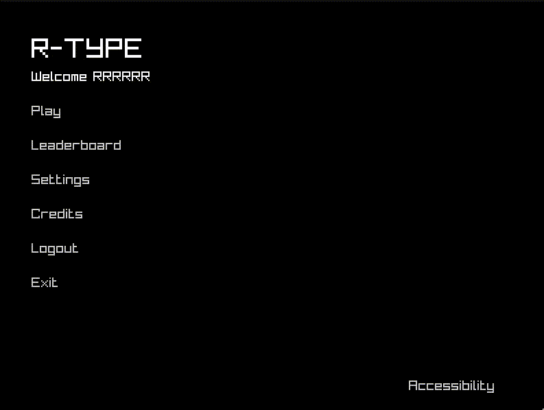

## Utilité des fonctionnalités d'accessibilité

Les fonctionnalités d'accessibilité sont essentielles pour rendre les applications utilisables par tous, y compris les personnes ayant des handicaps. Dans notre application, nous avons implémenté plusieurs fonctionnalités pour améliorer l'accessibilité :

### Lecture de texte par synthèse vocale

Lorsque l'utilisateur clique sur le bouton "Accessibility", une fonctionnalité de synthèse vocale est activée. Cette fonctionnalité permet de lire à haute voix chaque mot du menu lorsque l'utilisateur passe la souris dessus. Cela est particulièrement utile pour les personnes ayant des difficultés de vision ou de lecture, car elles peuvent naviguer dans le menu en écoutant les options disponibles.

### Navigation par touches

Pour les utilisateurs qui ne sont pas à l'aise avec l'utilisation d'une souris, nous avons également rendu possible la navigation dans le menu à l'aide des touches du clavier, comme les flèches. Cela permet aux utilisateurs ayant des difficultés motrices de naviguer facilement dans l'application sans avoir besoin d'utiliser une souris.

Ces fonctionnalités montrent notre engagement à rendre notre application accessible à tous, en fournissant des outils qui aident les utilisateurs à interagir avec l'application de manière plus intuitive et inclusive.

