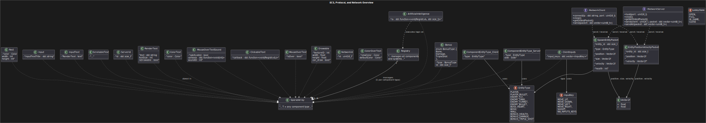
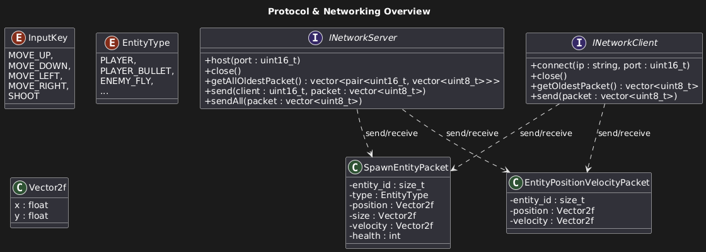
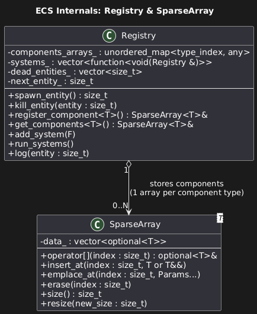
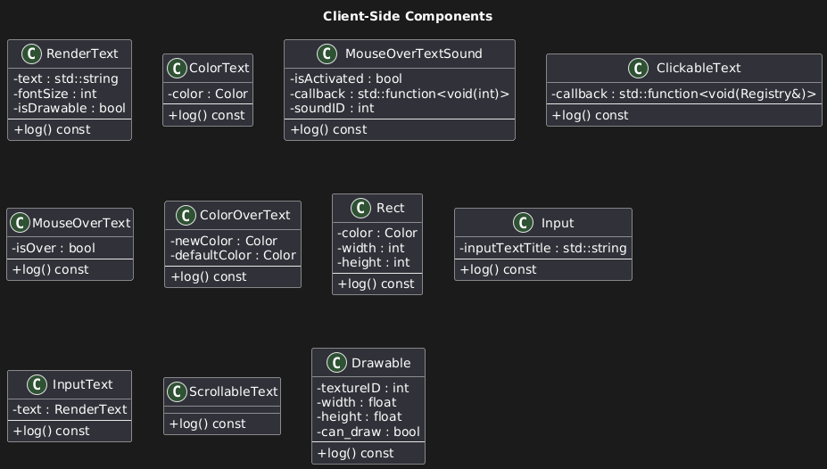
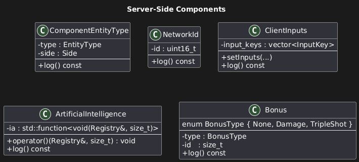

# Introduction

This is our guide on how to start contributing to R-Type.

## What's R-Type?
R-Type is a horizontally scrolling shooter arcade video game developed and released by Irem in 1987 and the first game in the R-Type series. The player controls a star ship, the R-9 "Arrowhead", in its efforts to destroy the Bydo, a powerful alien race bent on wiping out all of mankind.

## Why did we create this game?
This is one of our 3 biggest projects in our third year at [Epitech](https://www.epitech.eu/), the goal is to create our own game engine inspired by R-Type's gameplay in C++.

## ECS
ECS is the acronym for **Entity Component System**, an architectural design pattern widely used in video game development. This pattern emphasizes the principle of composition over inheritance, offering a flexible and modular alternative to traditional Object-Oriented Programming (OOP).

### Why ECS?
In game development, especially for projects like R-Type, managing large numbers of game objects efficiently is critical. Traditional OOP approaches often lead to complex and rigid inheritance hierarchies, which are hard to maintain and extend. ECS solves these issues by:

1. **Promoting Composition:** Game entities are built by combining small, reusable components instead of relying on deep inheritance trees.
2. **Improving Performance:** Systems process components in batches, often allowing better memory locality and cache efficiency.
3. **Enabling Flexibility:** Adding or modifying entity behavior becomes as simple as adding or removing components, making ECS ideal for fast-paced, dynamic games.

By adopting ECS, we ensure that our game engine remains scalable, modular, and performant while allowing us to iterate quickly.

### Core Concepts

#### Entity
An **Entity** is a unique identifier that represents a game object. An entity itself does not contain any data; instead, it acts as a container for components.

#### Component
A **Component** is a plain data structure that holds specific attributes related to an entity. Components do not contain logic. For example, a `Position` component holds positional information:

```cpp
struct Position
{
   float x;
   float y;
};
```

Other examples of components could include:
- `Velocity` (speed and direction of movement)
- `Drawable` (sprite or graphics information)
- `Hitbox` (collision detection data)

#### System
A **System** contains the logic that operates on entities with specific components. Systems scan through entities, identify those with the relevant components, and process them. For instance, a **Render System** might operate on entities with `Position` and `Drawable` components to render them on screen:

```cpp
inline void drawRectangles(Registry &r) {
    auto &positions = r.get_components<Position>();
    auto &rects = r.get_components<Components::Rect>();
    Graphic::IRenderer &renderer = Client::getInstance().getRenderer();

    for (auto &&[pos, rect] : Zipper(positions, rects)) {
        renderer.drawRectangle(pos.x, pos.y, rect.width, rect.height, rect.color.r, rect.color.g, rect.color.b, rect.color.a);
    }
}
```

#### Registry
The **Registry** manages the entities, components, and systems. It allows entities to be created or destroyed and handles the addition and removal of components.

### ECS for us
We chose ECS for our game engine because it allows us to efficiently manage the various game objects and their behaviors. For example:
- **Player Ship:** Composed of `Position`, `Velocity`, `Drawable`, and `Hitbox` components.
- **Enemy Units:** Might have `Position`, `AI`, `Drawable`, and `Hitbox` components.
- **Projectiles:** Include `Position`, `Velocity`, `Damage`, and `Drawable` components.

By sequencing systems from components, we can create reusable systems that interact smoothly with different entity types. This modularity makes the addition of new features or modify existing ones with minimal effort.

### Benefits of ECS in Game Development
1. **Scalability:** Adding more entities or components does not require changes to existing systems.
2. **Reusability:** Systems can operate on any entity with the appropriate components, promoting code reuse.
3. **Performance:** Components are stored in 'close' memory, which improves cache efficiency and execution speed.
4. **Maintainability:** ECS reduces the complexity of code, making it easier to debug, maintain, and extend.

### Diagrams and Visuals

#### UML Diagram

This UML diagram provides an overview of the system architecture, showing the relationships between different components, entities, and systems. It helps in understanding how various parts of the ECS interact with each other.

#### Protocol Diagram

The protocol diagram illustrates the communication protocol used in the game engine. It shows how data is transmitted between the client and server, including the types of messages exchanged and their sequence.

#### Sparse Set Diagram

This diagram explains the sparse set data structure used for efficient component storage and retrieval. Sparse sets allow for quick access to components by entity ID, improving performance in the ECS.

#### Client Components Diagram

The client components diagram details the components that are specific to the client-side of the game engine. It shows how these components are organized and how they interact with client systems.

#### Server Components Diagram

The server components diagram outlines the components used on the server-side. It highlights the server-specific components and their interactions with server systems, ensuring proper game state management and synchronization.
