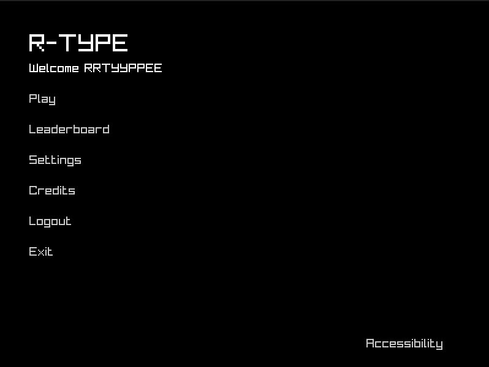
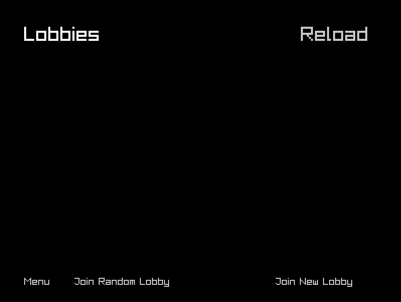
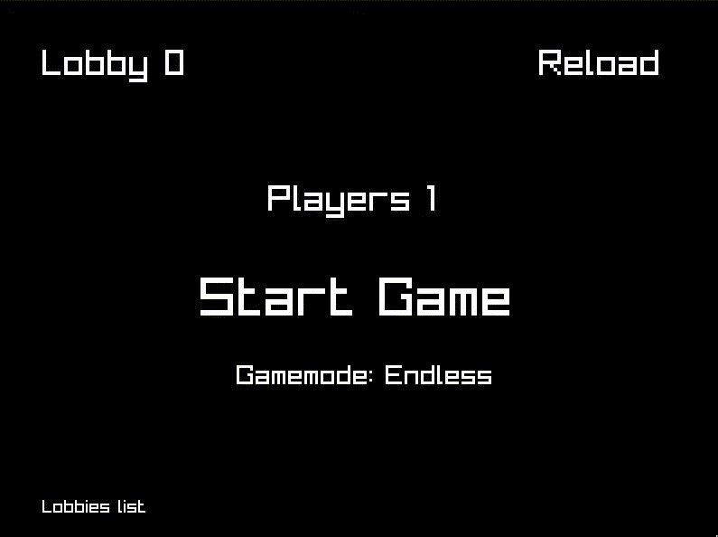
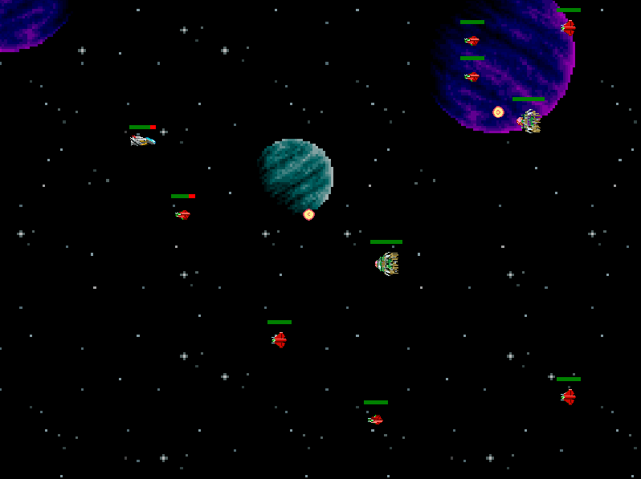
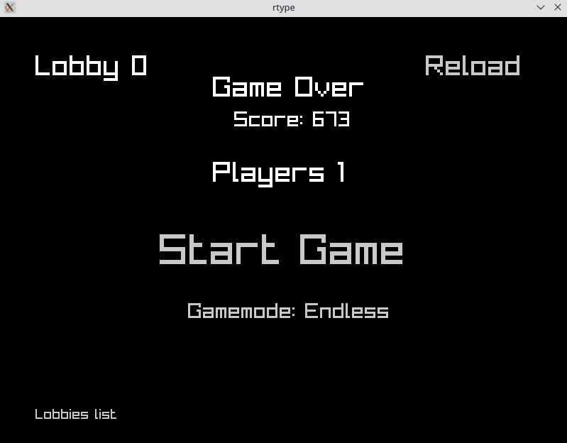

# The gameplay!

## Welcome to the menu :)

An explanation of the menu:

- **Play**: Let you choose between joining a random lobby or creating a new one.
- **Leaderboard**: This is the game leaderboard with the 10 best players/scores
- **Settings**: Settings to configure your frame rate and the volume of the game etc..
- **Credits**: The contributors of the game
- **Logout**: Logout from the game
- **Exit**: Take a pause and quit the game to restart next day :)
- **Accessibility**: Enable the accessibility features (text-to-speech, keyboard navigation)

## The lobby
An explanation of the lobby:

- **Menu**: return to the menu
- **Join Random Lobby**: List and let the player join a random opened lobby
- **Join New Lobby**: create a new lobby
- **Reload**: reload lobby's page to see new lobbies created

## The game

Here you will find the **Start** button as well as a "Gamemode" click on it to choose between the 2 available gamemodes:
- **Campaign**: A level based game mode where you have to destroy all the asteroids to pass to the next level.
- **Endless**: A game mode where you have to survive as long as possible.

## The gameplay

Your `Life` is represented by the green bar at the top of your ship. You have to avoid the asteroids and destroy them by shooting them with your ship's bullets. You can move your ship with the `arrow keys` and shoot with the `space bar`.

Colliding with an asteroid or a ship/ship's bullet will make you lose some life.

This is an example of the gameplay in `endless` mode. You have to survive as long as possible by destroying the asteroids.

In `campaign` mode, you have to destroy all the asteroids as well as the boss to pass to the next level.

## Be ready to die, it's really difficult

